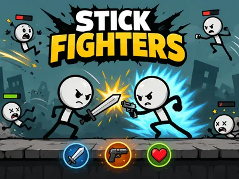
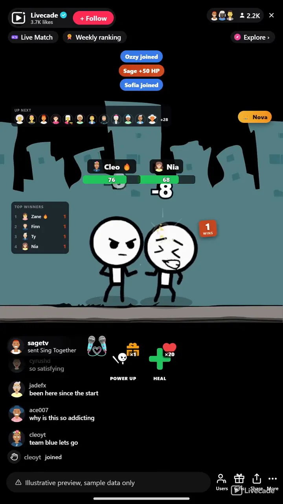

# Stick Fighters - Interactive TikTok Live Game

> Your viewers duel one on one, win to keep the stage.

Your viewers line up to duel one on one. Each fighter earns HP from gifts and upgrades from fists to a sword to a pistol, auto-battling in the center while everyone else waits in the queue. Win to keep the stage and build the longest streak.

**[Play Stick Fighters on Livecade](https://livecade.io/games/stick-fighters/?utm_source=github&utm_medium=readme&utm_campaign=stick-fighters)** - runs as a single browser source in OBS, Streamlabs, or TikTok LIVE Studio. Nothing for viewers to install.

## How viewers play

Viewers take part with the actions TikTok already gives them: **comments**, **gifts**, **likes**. Every action below is rebindable, so you decide which interaction drives which effect.

| Action | What it does |
| --- | --- |
| **Join the fight** | Adds the viewer to the duel queue to wait their turn on stage |
| **Power up my fighter (HP)** | Banks HP onto the sender's fighter, upgrading its class and topping it up live if it is on stage |
| **Heal my fighter on stage** | Tops up the sender's HP, but only while their fighter is currently dueling |

## How it works

### Line up and duel

Viewers join a queue and fight one on one in the center of the stage. The winner stays on to face the next challenger, and everyone else waits in a visible line for their turn.

### Gifts power up and upgrade

Gifts bank HP onto a viewer's fighter and upgrade its class from fists to a sword to a gunslinger, each with its own energy aura. HP is never reset on a win, so the crowd keeps healing and powering up the champion.

### Win the stage, build the streak

Underdogs hit harder when out-tanked and every hit lands chip damage, so a fresh challenger can still topple a whale. A win-streak badge, a top-supporter crown, and a top-winners board track who is dominating.

## About the game

Stick Fighters turns your chat into a duel ladder. Two viewers fight one on one in the center of the stage while everyone else waits in a visible queue, and the winner stays on to take the next challenger.

### Gifts bank HP and upgrade the class

Every fighter is a viewer, and spending moves them up the tiers, from bare fists to a sword to a hybrid gunslinger that shoots at range and slashes up close, each upgrade lighting up an energy aura. HP is never reset on a win, so a champion carries their wounds into the next bout and the crowd keeps healing and powering them up to keep the streak alive.

### A fresh challenger can still topple a whale

Underdog fighters hit harder when out-tanked and every hit lands chip damage, so nobody is shut out by someone who has spent more. Floating damage numbers, crits, screen shake, a win-streak badge, a top-supporter crown and a top-winners board keep the stage loud, and demo bouts fill in until real viewers join.

## What it looks like on stream

[Watch Stick Fighters gameplay](https://cdn.livecade.io/games/stick-fighters.mp4)

## What you can configure

- **Interface language** - Twelve languages for the on-screen chrome
- **Fight pace** - Scales damage per hit, from long back-and-forth bouts to fast, punchy KOs
- **Starting HP and HP per gift coin** - How much HP a fighter spawns with and gains from each coin of a gift
- **Class unlock thresholds** - How much banked HP unlocks the sword and the gunslinger
- **Win banner hold** - How long the KO celebration holds before the next bout
- **Queue avatars shown** - How many waiting fighters appear in the queue strip
- **Demo bouts** - Auto-battling filler fighters before real viewers join so the stage is never empty
- **Leaderboard** - Show a live top-winners board, and how many entries
- **Show game background** - Toggle the built-in arena art off to run your own backdrop only
- **Background** - Transparent, a solid color, or your own image behind the fight

## Languages

English, Spanish, Portuguese, French, German, Italian, Indonesian, Arabic, Turkish, Russian, Hindi, Romanian

## FAQ

<strong>How do viewers join Stick Fighters?</strong>

Viewers join the duel queue straight from your TikTok Live chat, and by default entering the live adds them automatically. Two fighters duel at a time and everyone else waits in a visible line, so any audience size works.

<strong>Do viewers have to send gifts to play?</strong>

No. Joining the queue is free. Gifts bank HP onto a viewer's fighter and upgrade it from fists to a sword to a gunslinger, and likes can heal a fighter on stage, which is what drives gifting during a bout.

<strong>Can a small gifter still win?</strong>

Yes. Speed is a random roll, not bought, so a whale is never automatically faster. Underdog fighters hit harder when out-tanked and every hit lands guaranteed chip damage, so a fresh challenger can still topple a heavily gifted champion.

<strong>How do I add Stick Fighters to my TikTok Live?</strong>

Add one browser source URL to OBS or your streaming software and go live. There is no plugin to install and nothing for your viewers to download.

## Setup

1. [Create a Livecade account](https://app.livecade.io/register?utm_source=github&utm_medium=cta&utm_campaign=stick-fighters)
2. Copy your overlay browser source URL
3. Paste it into OBS, Streamlabs, or TikTok LIVE Studio
4. Pick Stick Fighters, set your triggers, and go live

Runs in the browser, so it works on Windows and macOS with nothing to download. [See all TikTok Live games](https://livecade.io/tiktok-live-games/?utm_source=github&utm_medium=readme&utm_campaign=stick-fighters).

---

_This repository documents Stick Fighters, a hosted interactive game by [Livecade](https://livecade.io/?utm_source=github&utm_medium=footer&utm_campaign=stick-fighters). The game runs on Livecade's platform, so there is no source to install here._
